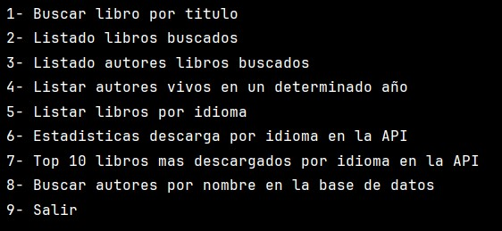
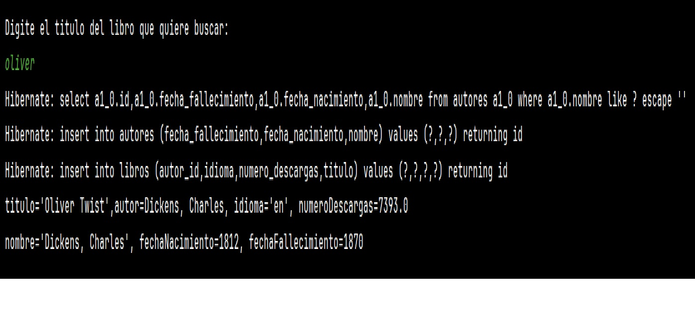
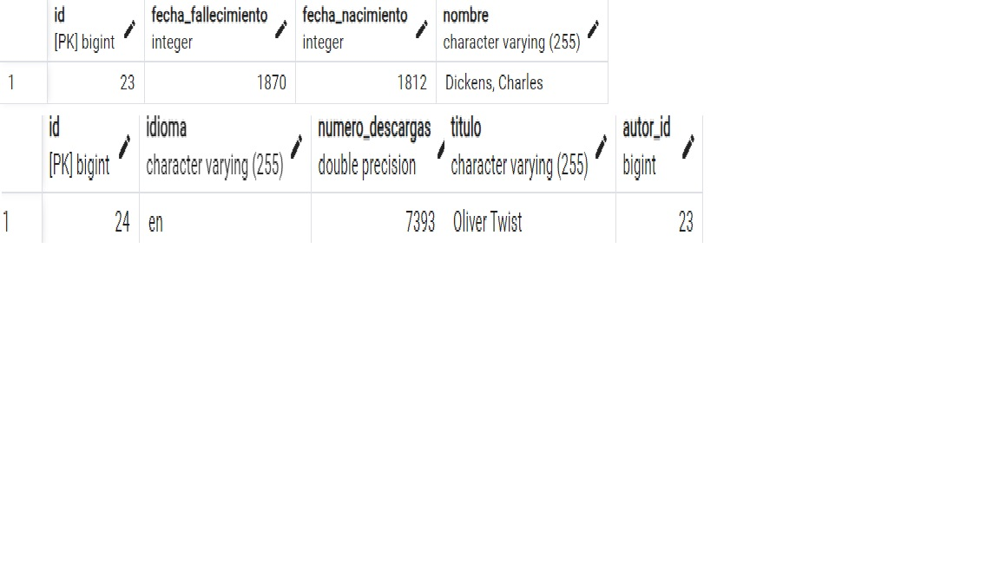
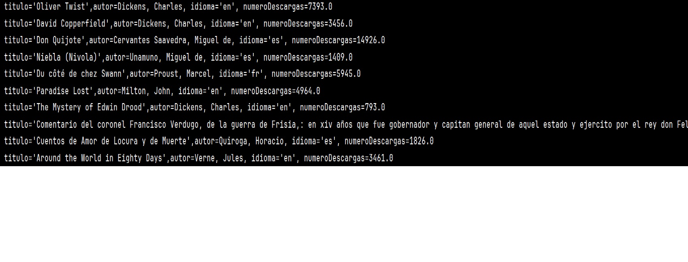
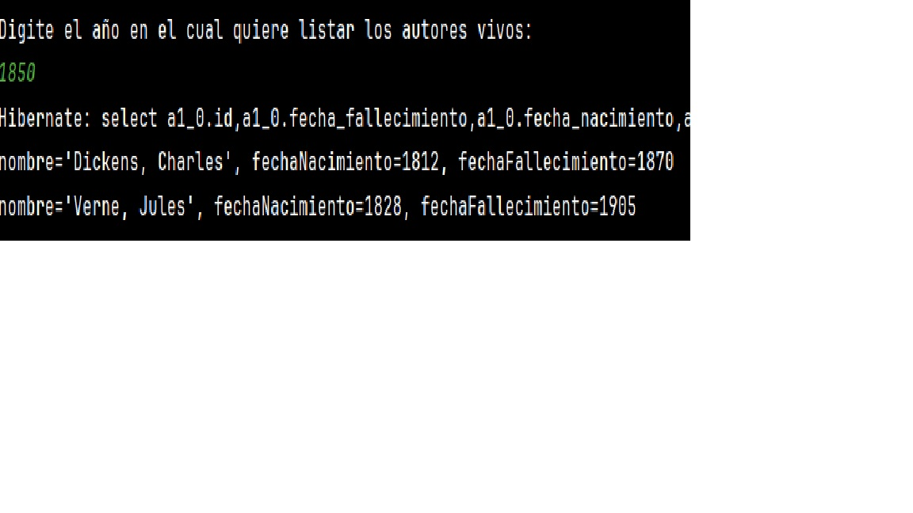
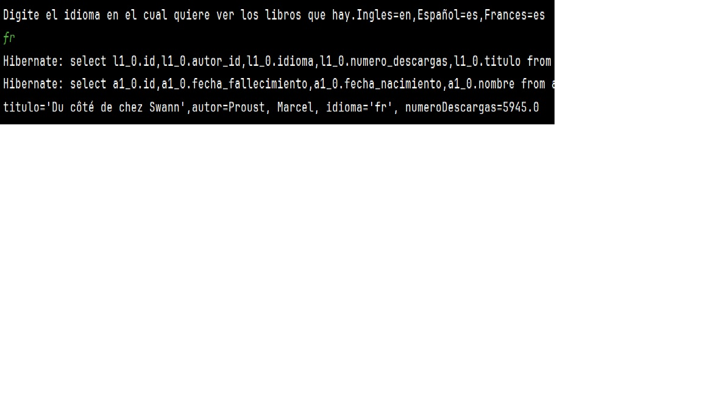
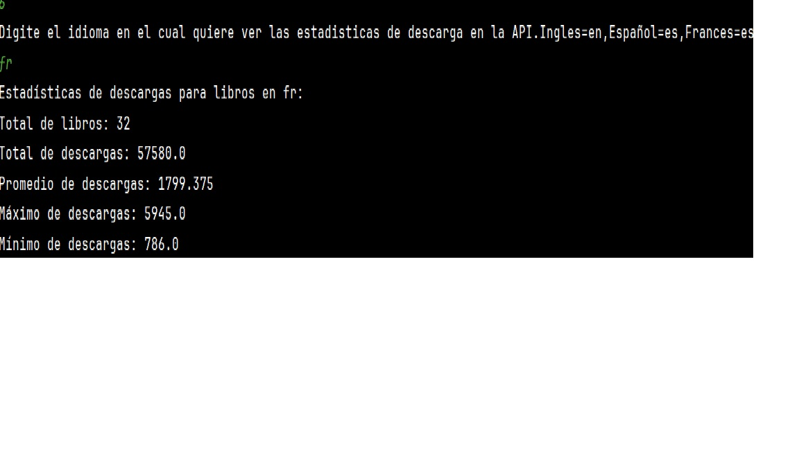
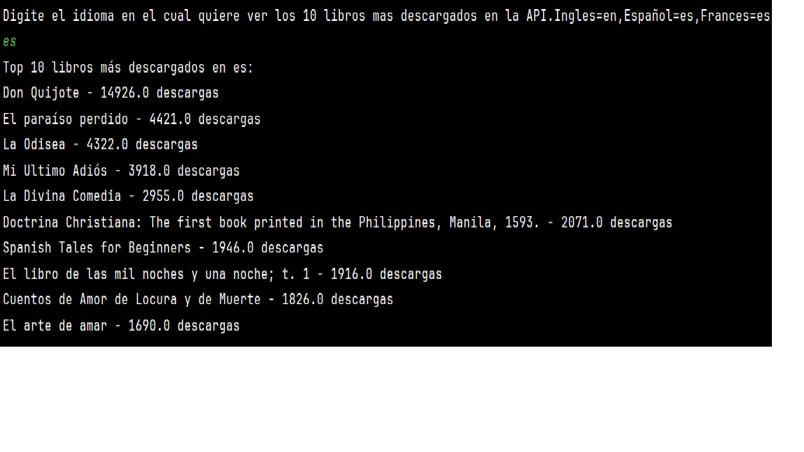
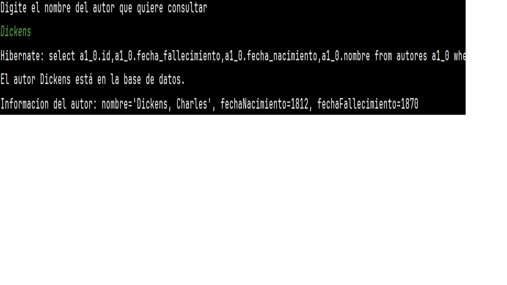

<em> LITERALURA </em>
## Índice

- [Descripción del proyecto](#descripción-del-proyecto)
- [Estado del proyecto](#estado-del-proyecto)
- [Características de la aplicación y demostración](#características-de-la-aplicación-y-demostración)
- [Tecnologías utilizadas](#tecnologías-utilizadas)
- [Personas Desarrolladoras del Proyecto](#personas-desarrolladoras-del-proyecto)
- [Conclusión](#conclusión)

## Descripción del proyecto

Este proyecto consiste en un programa que realiza consultas a la API https://gutendex.com; y va agregando los datos del libro a dos tablas(libros y autores) en una base de datos local. El aplicativo cuenta con diferentes funcionalidades que permiten al usuario interactuar con la API y la base de datos.

.

## Estado del proyecto

Actualmente, el proyecto es funcional, aunque pueden existir áreas de mejora y optimización expecialmente en un manejo mas exhaustivo de las excepciones y se podrian agregar otras opciones de busqueda para hacerlo más completo. Es necesario revisar el codigo en una etapa de desarrollo 2 y agregarle nuevas funcionalidades y suprimir las lineas de codigo que no son necesarias.

## Características de la aplicación y demostración

La aplicación ofrece las siguientes características:
  .
  .
  .
  .
  .
  .
  .
  .
  .
  
## Tecnologías utilizadas

El proyecto utiliza las siguientes tecnologías:
- IntelliJ IDEA 2023.3.6 (Community Edition)
- Spring
- Java
- postgres
- API de https://gutendex.com/
- Git
- ChatGPT

## Personas Desarrolladoras del Proyecto

Este proyecto fue desarrollado por:

- [Juan Miguel Méndez Granados](#) - Desarrollador principal
- [Instrutores y colaboradores Alura](#) - Colaborador

## Conclusión

La aplicación Literalura es una herramienta útil para realizar busquedas y consultas a la API gutendex.com de libros de manera rápida y sencilla. Me ha permitido incursionar en el uso del framework spring, no hay sido facil pero fue un reto que que me ha ayudado a poner en practica conceptos aprendidos en la especialización de backend en el programa ONE.Todavia la aplicación presenta ciertas fallas que la hacen inestable en algunas busquedas, pero todas las funcionalidades fueron probadas y sirve. Si tienes alguna pregunta, sugerencia o problema, favor ponerse en contacto conmigo.Gracias.

